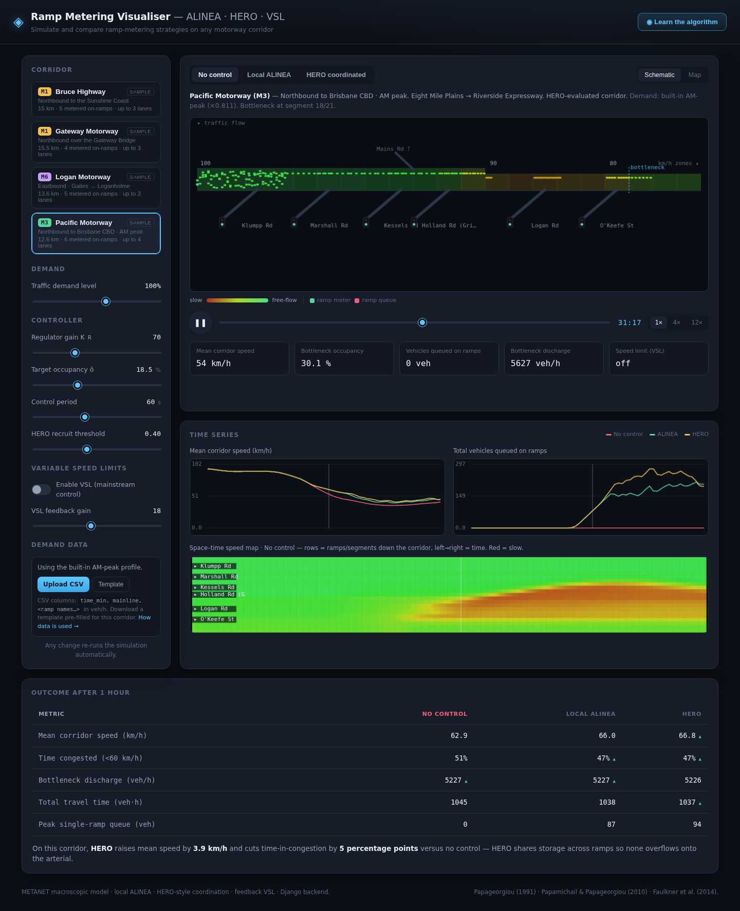

# Ramp Metering Visualiser

**Simulate and compare freeway ramp-metering strategies — no control, local
ALINEA, coordinated HERO, and variable speed limits — on any motorway corridor,
in your browser.**


The app runs a macroscopic **METANET** traffic model on the server and plays the
result back as an animated freeway schematic, a geographic map, a space–time
speed map and time-series charts — so you can *see* how metering keeps a
bottleneck flowing. It ships with example corridors and lets any agency add its
own network and feed real demand data.



> **On the bundled data:** the example corridors are *representative* models —
> real route, interchange, lane and speed-limit information with **approximated**
> chainages, demands and geography. They are for demonstration and teaching, not
> operational analysis. Bring your own corridors and counts for real work
> (see [docs/INTEGRATION.md](docs/INTEGRATION.md)).

---

## Features

- **Three control strategies, side by side** — no control, local **ALINEA**
  integral feedback, and **HERO** coordinated metering, each with an optional
  **variable-speed-limit (VSL)** layer.
- **Multi-ramp corridors** with per-segment lane counts, speed-limit zones,
  lane-drop bottlenecks and off-ramps.
- **Animated schematic** — speed-coloured road, flowing vehicles that bunch in
  slow zones, per-ramp signals and queues.
- **Geographic map** (Leaflet) with ramp markers that recolour by live speed.
- **Space–time speed map**, mean-speed and ramp-queue charts, and an outcome
  scoreboard (speed, % time congested, discharge, total travel time, peak queue).
- **Built-in learning tool** — a "Learn the algorithm" screen: nine numbered
  lessons with typeset equations, worked numeric examples, a live fundamental
  diagram, control-loop and coordination diagrams, a symbol reference, and
  "try it" hooks that point you at the matching control in the sim.
- **Bring your own corridor** — drop a JSON file in a folder.
- **Bring your own data** — upload a demand CSV; it drives the model directly.
- **No database, no build step** — pure Python + vanilla JS; runs offline
  (except the optional map tiles).

## Quick start

```bash
git clone https://github.com/<you>/ramp-metering-visualiser.git
cd ramp-metering-visualiser
python -m venv .venv && source .venv/bin/activate      # optional
pip install -r requirements.txt
python manage.py runserver
```

Open **http://127.0.0.1:8000/**. No migrations or database are required.

Run the tests with `python manage.py test`.

## Bring your own corridor

Corridors are plain JSON files in `simulator/data/corridors/` (or any folder you
point `RMV_CORRIDOR_DIR` at). Copy `_TEMPLATE.json`, fill in your sections and
ramps, and restart:

```json
{
  "id": "my_freeway", "name": "My Freeway (A99)", "route": "A99",
  "calibrate": false,
  "seg_length": 0.5,
  "sections": [{"len_km": 4.0, "lanes": 3, "vlimit": 100},
               {"len_km": 3.0, "lanes": 2, "vlimit": 90}],
  "mainline_demand": 4200,
  "ramps": [{"km": 1.0, "name": "First St", "demand": 900, "kind": "on"}],
  "geo": [[-27.50, 153.00], [-27.46, 153.06]]
}
```

Set `"calibrate": false` to use your demand numbers **as-is** (real data) instead
of the synthetic auto-calibration. Full schema and an OpenStreetMap
geometry recipe are in **[docs/INTEGRATION.md](docs/INTEGRATION.md)**.

## Bring your own data

The **Demand data** panel accepts a CSV of time-varying demand (veh/h):

```
time_min, mainline, First St, Second Av
0,   2600,  600,  700
5,   2900,  700,  820
```

`time_min` is minutes from the start; `mainline` is the upstream entry demand;
each remaining column is an on-ramp matched to the corridor **by name**. Use the
in-app **Template** button to download a correctly-headed file for the selected
corridor. The CSV is parsed in the browser and validated server-side.

## Documentation

| Guide | What it covers |
|---|---|
| **[User Guide](docs/USER_GUIDE.md)** | Every control on the screen, and how to read the outputs. |
| **[Integration Guide](docs/INTEGRATION.md)** | Corridor schema, real geometry from OSM, the demand CSV, the JSON API, extending the model, and production deployment. |
| **[Model & Algorithms](docs/MODEL.md)** | The METANET equations, the fundamental diagram, ALINEA, HERO, VSL, capacity drop, calibration, and limitations. |

## Project structure

```
alineavis/            Django project (settings, urls, wsgi/asgi)
simulator/
  engine.py           METANET model + ALINEA + HERO + VSL (pure Python)
  corridors.py        loads corridor JSON, expands + calibrates
  views.py            page shell + JSON API (/api/simulate, /api/corridors)
  data/corridors/     one JSON file per corridor (+ _TEMPLATE.json)
  templates/          single-page UI
  static/             style.css, app.js (canvas schematic, charts, Leaflet map)
  tests.py            engine + API tests
docs/                 user, integration and model guides
manage.py
```

## How it works (in one line)

A freeway carries the most traffic at a *critical* density; letting an unmetered
ramp push it past that point triggers a **capacity drop** and the bottleneck
breaks down. Ramp metering holds the merge just below the tipping point — trading
a short ramp queue for a freely-flowing mainline. See
[docs/MODEL.md](docs/MODEL.md).

## References

- Papageorgiou, Hadj-Salem & Blosseville (1991), *ALINEA: A Local Feedback
  Control Law for On-Ramp Metering*, TRR 1320.
- Papamichail & Papageorgiou (2010), *HERO coordinated ramp metering at the
  Monash Freeway*, TRR 2178.
- Faulkner, Dekker, Gyles, Papamichail & Papageorgiou (2014), *Evaluation of
  HERO-Coordinated Ramp Metering on the M1/M3, Queensland*, TRR 2470.
- Kotsialos & Papageorgiou (2002), *METANET*, IEEE Trans. ITS.

## Contributing

Issues and pull requests are welcome — see
[CONTRIBUTING.md](CONTRIBUTING.md).

## License

[MIT](LICENSE). The bundled example corridors are approximations, not official or
survey data, and carry no warranty.
