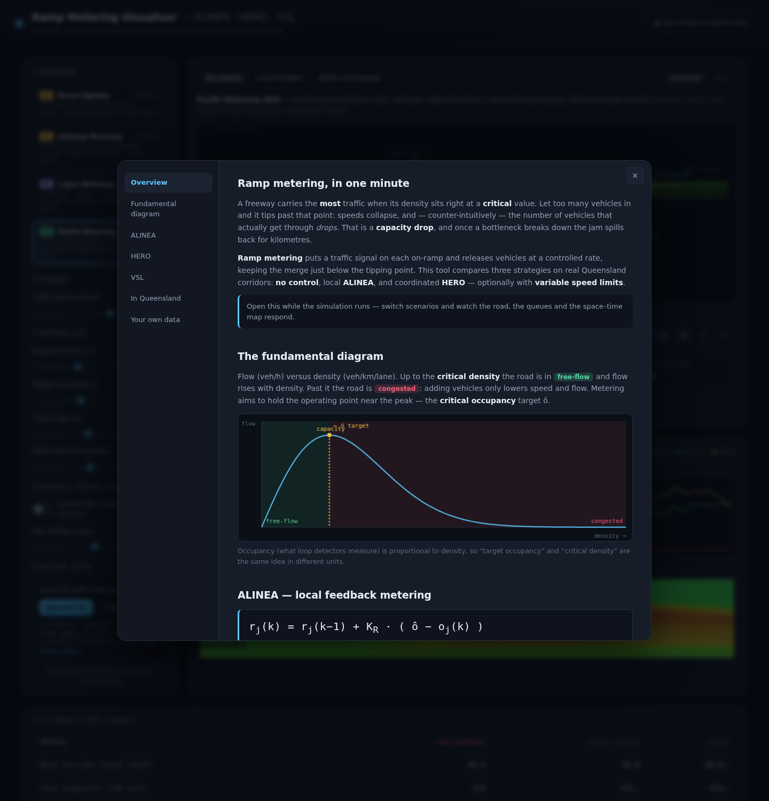
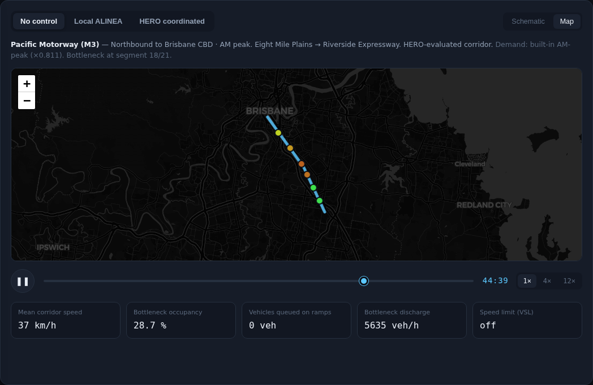

# User Guide

A tour of every control on the screen and how to read the outputs. For the
science behind it, see [MODEL.md](MODEL.md); to add your own network or data, see
[INTEGRATION.md](INTEGRATION.md).

## The layout

- **Left panel** — pick a corridor, set demand and controller parameters, toggle
  VSL, and upload demand data.
- **Centre stage** — the animated **Schematic** or geographic **Map**, a
  play/scrub transport bar, and live readouts.
- **Charts** — mean speed and ramp-queue time series, plus a space–time speed map.
- **Scoreboard** — the one-hour outcome for all three strategies, with a verdict.
- **How ALINEA & HERO work** (top-right) — a full explainer with a live
  fundamental diagram and control-loop diagrams.

## Choosing what to run

- **Corridor** — click a card. Cards marked **sample** are representative example
  networks; your own corridors appear here too (see the Integration Guide).
- **Scenario tabs** (above the stage) — *No control*, *Local ALINEA*, *HERO
  coordinated*. This picks which run drives the animation and readouts.
- **Enable VSL** (left panel) — layers variable speed limits on top of the
  current scenario; the scoreboard switches to the "with VSL" comparison.

## Controls

| Control | What it does |
|---|---|
| **Traffic demand level** | Scales all demand (60–130 %). Push it up to force a breakdown. |
| **Regulator gain K_R** | ALINEA's responsiveness. Higher = faster correction, but jumpier. |
| **Target occupancy ô** | The occupancy ALINEA aims to hold — set near critical for max flow. |
| **Control period** | How often the metering rate is recomputed (seconds). |
| **HERO recruit threshold** | How full a bottleneck ramp gets before it recruits upstream ramps. |
| **VSL feedback gain** | How aggressively speed limits drop upstream of the bottleneck. |
| **Sign hold time** | Minimum seconds a posted VSL must stand before the signs may change again. |
| **VSL zone length** | How far upstream the lowest limit is posted (the controlled zone). |

VSL runs the two functions Queensland gantries run. **Flow control** posts a
limit — proportional to how far the worst detector runs over target — across
the VSL zone length upstream of the bottleneck. **Queue protection** covers the
whole detected queue with speed-matched signs that follow its back as it grows
(extending upstream immediately, retracting on the hold clock). Signs post in
10 km/h steps, change at most 20 km/h per hold, and taper …80 → 60 → 40 on
approach. On the schematic the dashed bracket and signs show exactly what the
engine posted; the space–time map outlines the covered area in amber so you
can watch it track the queue; the speed chart overlays the posted limit.
Protection alone costs a little mainline speed — the throughput win appears
when VSL is layered on ALINEA or HERO.

Any change re-runs the simulation automatically.

## Reading the schematic

- The **road** is coloured by speed — green (free-flow) to red (slow). Lane drops
  make the road narrower. Speed-limit zones are labelled along the top.
- **Vehicles** flow left→right and naturally bunch where the model slows down.
- Each **on-ramp** shows a metering signal and a growing **queue** of red
  vehicles; **off-ramps** are drawn as exit arrows.
- The **bottleneck** detector is marked with a dashed line.
- The legend under the road decodes the colours and the meter/queue markers.

## Reading the map

The **Map** tab shows the corridor alignment with a marker at each on-ramp that
recolours by live speed and grows with queue length. It needs an internet
connection for the map tiles; the Schematic view works offline.

## Charts and readouts

- **Mean corridor speed**, **Total vehicles queued on ramps** and **Bottleneck
  occupancy** (against the dashed target ô) — plotted for all three strategies
  at once, with a moving time cursor.
- **Space–time speed map** — rows are points down the corridor (ramps labelled),
  left→right is time. Red diagonals are congestion waves travelling upstream.
- **Live readouts** — mean speed, bottleneck occupancy, vehicles queued, discharge
  flow, and the current VSL speed limit at the scrubbed time.
- Click or drag **any chart** to move the shared time cursor; hover for exact
  values. On the schematic, hover the road to inspect a segment. **Space**
  toggles play/pause and **←/→** step one minute.
- **Pin baseline** snapshots the current run: it stays on the time-series and
  per-ramp charts as faint lines while you change sliders, so you can see
  exactly what a different gain, target or demand level buys you. While a
  baseline is pinned, every scoreboard cell also shows a green/red delta
  against it. Click the blue chip to clear it (switching corridor clears it
  too).
- **⧉ Share setup** (header) copies a link that reproduces your current
  corridor, sliders, scenario and view — the settings live in the URL, so any
  configuration can be bookmarked or sent to a colleague.
- The **Demand** section shows a live preview of the traffic entering the model
  over the hour — mainline and total on-ramp demand, following the demand-level
  slider and any uploaded CSV profile.

## Per-ramp detail

Click any on-ramp arm on the schematic (or a ramp marker on the map) to open a
detail panel with that ramp's **queue vs its storage limit**, **metering rate
vs unmetered capacity**, and **occupancy at the merge vs target ô** for all
three strategies. The panel header shows the live meter state phrased as real
signal operation — the release rate and its equivalent seconds-per-vehicle
cycle time. This is where the control logic is easiest to see: ALINEA
throttles the rate as merge occupancy passes ô, the queue-override releases the
meter when storage fills (the sawtooth), and under HERO an upstream ramp's rate
dips while its own occupancy is still healthy — it has been recruited to store
vehicles for the bottleneck ramp. Press **Esc** or ✕ to close.

## The scoreboard

The one-hour outcome for each strategy: mean speed, % of time congested
(< 60 km/h), bottleneck discharge, total travel time, and the peak single-ramp
queue. The best cell in each row is flagged, and the verdict summarises HERO's
gain over no control.

> **Note on total travel time:** metering trades mainline delay for ramp-queue
> delay, so TTT is often close between strategies unless a capacity drop is
> avoided or VSL reduces the load. The clearest wins usually show up in **mean
> speed** and **% time congested**. See [MODEL.md](MODEL.md#why-the-numbers-move).

## Using real demand data

Open **Demand data → Template** to download a CSV pre-filled for the current
corridor, edit it with your counts (veh/h by minute), and **Upload CSV**. The
caption switches to *"Demand: uploaded profile"* and the status shows how many
ramps were matched. Click **Use built-in** to return to the synthetic profile.
Format details are in the [Integration Guide](INTEGRATION.md#5-the-demand-csv).
